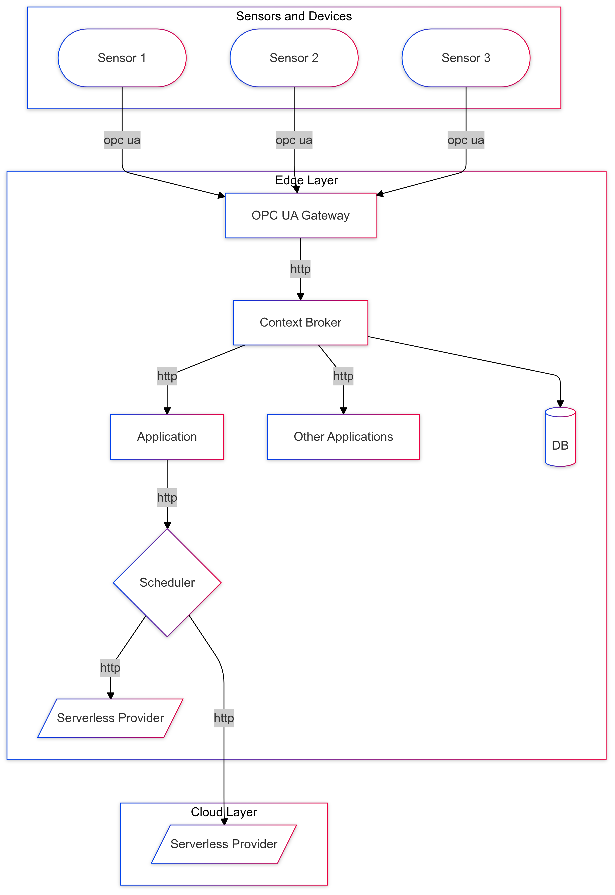

# General Description

The main part of this thesis consists of an opcua-gateway which subscribes to machine sensores via OPC UA and invokes functions on nuclio (called via http). This process is started by sending a request to the gateway with a body containing the node-id's in the body (`curl -X POST -H "Content-Type: application/json" -d '{"nodeIDs": ["ns=3;s=\"DBI_Stößeldruck\".\"tx_Stößeldruck\""]}' http://localhost:8880/start`). To access the deployment created by ansible, please replace localhost with the minikube ip (for example `192.168.49.2`). This is logged at the end of the ansible deployment too.

The nuclio-functions directory contains code and configurations for various nuclio functions.

Prototype contains a test implementation for a OPC UA client and more importantly a UPC UA server, where the latter is used for local testing (run as docker container). This is also used in the ansible deployment, the node id on this used for testing is `ns=2;i=2`

# Nuclio
## Deployment of Nuclio iteself
- k8s: https://github.com/nuclio/nuclio/blob/development/docs/setup/k8s/getting-started-k8s.md
- minikube: https://github.com/nuclio/nuclio/blob/development/docs/setup/minikube/getting-started-minikube.md

## Function Deployment
- There are various ways for the deployment of functions explained in the docs, but it's important to include ALWAYS the namespace (for example `-n nuclio`) in the command since due to a bug it is ignored in the configuration file
- https://github.com/nuclio/nuclio/blob/development/docs/tasks/deploying-functions.md#deploying-a-simple-function
- example command: `nuctl deploy -n nuclio --path /home/schererd/master-thesis/master-thesis/nuclio-functions/prediction --http-trigger-service-type NodePort --registry $(minikube ip):5000 --run-registry localhost:5000`

# Ansible
The concrete deployment steps for minikube (local k8s cluster) are documented in the ansible-deploy.yml script. The k8s config map yaml file is automatically generated by ansible with the actual values lielike ip's and ports from the minikube cluster.

# Prereqisites and notes
- docker + minikube with ingress addon need to be installed 
- weird thing, probably coincidance: deployment fails because pods are getting stuck in status "ImagePullBackoff", they somehow can't pull images. BUT after minikube ssh and then listing docker containers with `docker ps` they are suddenly starting and the deployment works

# random notes
1. start prototype sensor server
2. start gateway and start
    - ` curl -X POST -H "Content-Type: application/json" -d '[{"id": "ns=2;i=2", "type": "MachineSensor", "attributeName": "temperature"}]' http://localhost:8880/start `
3. start orion broker with quantumleap
4. run scheduler
5. create a request to start a subscription for the consumer   
    - ` curl -v localhost:1026/v2/subscriptions -s -S -H 'Content-Type: application/json' -d '{"description": "Subscription for MachineSensor data", "subject": {"entities": [{"id":"ns:2,i:2", "type": "MachineSensor"}], "condition": {"attrs": ["temperature"]}}, "notification": {"http": {"url": "http://localhost:5000/notify"}, "attrs": ["temperature"], "timeseries": {"query": {"aggrMethod": "values", "limit": 10}}}, "expires": "2040-01-01T14:00:00.00Z"}' `
    - ` curl -v localhost:1026/v2/subscriptions -s -S -H 'Content-Type: application/json' -d '{"description": "Subscription for MachineSensor data", "subject": {"entities": [{"id":"ns:2,i:2", "type": "MachineSensor"}], "condition": {"attrs": ["temperature"]}}, "notification": {"http": {"url": "http://scheduler:5000/notify"}, "attrs": ["temperature"], "timeseries": {"query": {"aggrMethod": "values", "limit": 10}}}, "expires": "2040-01-01T14:00:00.00Z"}' `
6. start a subscription for quantumleap
    - ` curl -v localhost:1026/v2/subscriptions -s -S -H 'Content-Type: application/json' -d '{"description": "quantumleap subscription", "subject": {"entities": [{"id":"ns:2,i:2", "type": "MachineSensor"}], "condition": {"attrs": ["temperature"]}}, "notification": {"http": {"url": "http://quantumleap:8668/v2/notify"}, "attrs": ["temperature"], "metadata": ["dateCreated", "dateModified"]}}' `
7. if crate makes issues then increase max virtual memory areas and apply settings manually `sudo sysctl -p`

# orion cheat sheet
- list subscriptions ` curl 'http://localhost:1026/v2/subscriptions' `
- get latest entry in quantum `curl -G 'http://0.0.0.0:8668/v2/entities/ns:2,i:2/attrs/temperature'  --data-urlencode 'type=MachineSensor' --data-urlencode 'lastN=1'`

# scheduler DQN stuff
- if python has module problems again: ` export PYTHONPATH="${PYTHONPATH}:/home/davestar/master-thesis/master-thesis" `
- testing with: `  curl -X POST -H 'Content-Type: application/json' -d '{"subscriptionId": "676db27e5b374e50a1a75fb3", "data": [{"id": "ns:2,i:2", "type": "MachineSensor", "temperature": {"type": "StructuredValue", "value": [{"observedAt": "2024-12-26T20:52:07.534Z", "type": "Property", "value": 1.177303553}, {"observedAt": "2024-12-26T20:52:07.534Z", "type": "Property", "value": 1.185290337}, {"observedAt": "2024-12-26T20:52:07.634Z", "type": "Property", "value": 1.189311385}, {"observedAt": "2024-12-26T20:52:07.634Z", "type": "Property", "value": 1.199009418}, {"observedAt": "2024-12-26T20:52:07.735Z", "type": "Property", "value": 1.212143183}, {"observedAt": "2024-12-26T20:52:07.735Z", "type": "Property", "value": 1.224851012}, {"observedAt": "2024-12-26T20:52:07.834Z", "type": "Property", "value": 1.226114511}, {"observedAt": "2024-12-26T20:52:07.834Z", "type": "Property", "value": 1.236098886}, {"observedAt": "2024-12-26T20:52:07.934Z", "type": "Property", "value": 1.257515907}, {"observedAt": "2024-12-26T20:52:07.934Z", "type": "Property", "value": 1.264892578}], "metadata": {"dateCreated": {"type": "DateTime", "value": "2024-12-26T19:45:17.734Z"}, "dateModified": {"type": "DateTime", "value": "2024-12-26T20:52:07.935Z"}}}}]}' localhost:5000/notify `
